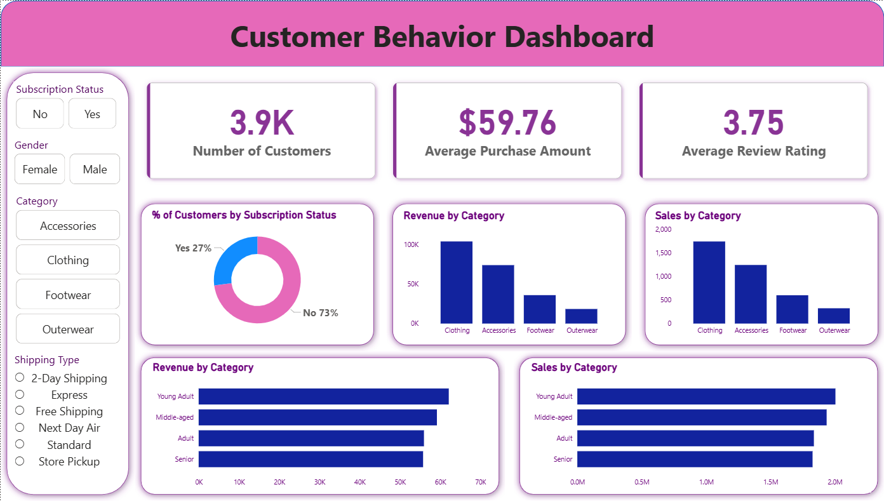

# 🛒 Customer Shopping Behavior: End-to-End ETL & BI Pipeline

An end-to-end data analytics engineering pipeline that processes consumer transactional logs using **Python**, warehouses structural data in **MySQL**, and delivers interactive executive insights via **Power BI**.

## 🚀 Project Architecture

1. **Extraction & Transformation (Python):** Cleans data using localized group-median imputation, handles standard `snake_case` normalization, and applies quantile binning (`pd.qcut`) for lifecycle demographic segmentation.
2. **Data Warehousing (MySQL):** Programmatically streams engineered datasets via `SQLAlchemy` into relational schemas to build analytical views and complex window functions.
3. **Business Intelligence (Power BI):** Connects to the database to serve high-density dashboard KPIs tracking gross revenues, discount impacts, and retention trends.

---

## 📊 Interactive Dashboard Preview

*Figure 1: Power BI Executive Dashboard capturing Key Metrics, Demographics, and Category Performance.*

---

